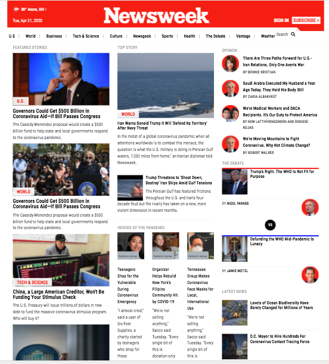

# newsweek-clone
This Html/CSS microverse project consists of building a replica of the news site known as [Newsweek](https://www.newsweek.com) using the Bootstrap framework.

Additional description about the project and its features.
In this Microverse project, I was required to make use of Bootstrap CSS classes to create a clone of [ the Newsweek website](https://www.newsweek.com/). Also, I ensured that the page layout did not break on smaller screens.

## Built With

- Html
- CSS
- Bootstrap framework

## Live Demo

[Live Demo Link](https://rawcdn.githack.com/krys2fa/newsweek-clone/243d4b551cbd4cb9afc5927d3c5fddabd051758e/index.html)

## Getting Started

**Click on the link above in order to see the Live Demo of the front end project.**

To get a local copy up and running follow these simple example steps.

### Prerequisites

- Web Browser
- Text Editor

### Setup

- Download repository files

## Authors

👤 **Christopher Amanor**

- Github: [@krys2fa](https://github.com/krys2fa)
- Twitter: [@krys2fa](https://twitter.com/krys2fa)
- Linkedin: [Christopher Amanor](https://www.linkedin.com/in/christopher-amanor-81a7b93b/)

## 🤝 Contributing

Contributions, issues and feature requests are welcome!

Feel free to check the [issues page](issues/).

## Show your support

Give a ⭐️ if you like this project!

## Acknowledgments

- Hat tip to anyone whose code was used
- Inspiration
- etc

## 📝 License

This project is [MIT](lic.url) licensed.
